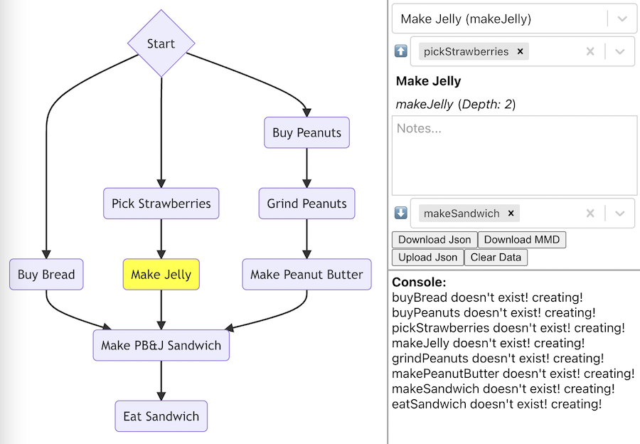

# Flowmeo
Flowmeo is a web tool to quickly make one-way, "dependency" flowcharts, like you might need for designing an adventure game, or a tech tree, or a skill tree. I made it primarily as an aid for designing video games, but it could be useful for a planning a variety of different kinds of projects.

You can try it out here: https://luvcraft.github.io/flowmeo/

Here's an overview video:

I built it using React (https://reactjs.org/) with Graphviz-React (https://www.npmjs.com/package/graphviz-react)

You can download the data from it as either JSON or mmd (mermaid markup), and upload data as JSON. It's designed to be used as a planning tool rather than to generate scripts that you can use directly for game logic, although there's no reason you couldn't use the data for game logic with a suitable system.
